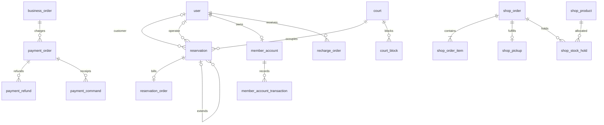

# 数据库设计说明书

版本：DBD v1.0；日期：2026-09-23；状态：现有结构核查与增量逻辑设计。[文档索引](README.md)。

新增表和字段已写入 [初始化脚本](../../sql/init.sql)，对应 [阶段八升级工具](../../scripts/migrate_staff_payments.py)。已在 MySQL 5.7.28 隔离库验证新建与升级结构一致、重复升级和历史记录守恒；详见 [开发记录](开发进度与验证记录.md)。散客、线上订场、商城与代充值的事务路径及全局流水投影已实现；隔离库 SQL 备份恢复与中断重跑已验证，正式业务库尚未升级，见 [D06 验收记录](D06验收记录.md)。

## 1. 阶段七基线数据模型

阶段七基线共 19 张表，阶段八初始化为 25 张表，使用 MySQL/InnoDB、utf8mb4，业务金额以整数分存储。

| 领域 | 已存在的表 | 主要关系 |
| --- | --- | --- |
| 身份会员 | `user`、`member_account`、`member_account_transaction` | 用户与会员账户一对一；账户流水多对一 |
| 场地预约 | `court`、`reservation`、`reservation_order` | 预约属于客户和场地；预约与订单一对一 |
| 运营 | `court_block`、`reservation_attendance`、`reservation_change` | 场地封锁；预约到场一对一；预约改期一对多 |
| 商城 | `shop_product`、`shop_order`、`shop_order_item` | 订单与明细一对多；明细引用商品并保留快照 |
| 内容 | `announcement`、`notification`、`club_event`、`event_registration`、`community_post` | 赛事与报名一对多；通知和动态关联用户 |
| 配置审计 | `config`、`operation_log` | 配置唯一键；操作日志记录角色、目标和内容 |

改造前的关键限制：`reservation.user_id` 与 `reservation_order.user_id` 非空；预约订单对 `reservation_id` 有唯一键；会员流水必须有 `user_id`；商城没有付款截止和核销凭证；场地封锁没有维修/包场分类。新设计应兼容这些约束，而不是只增加页面字段。

## 2. 目标关系

以下图为简化逻辑关系。`business_order` 表示现有预约订单、商城订单或拟新增充值单的抽象，不是计划新建的一张总订单表。

用户对历史订单经办关系可以为空，新建工作人员业务必须有经办人。散客不创建会员账户；不能把匿名散客的金额写进前台自己的账户流水。

## 3. 现有表的增量字段与约束

下列字段已落实到物理结构；散客状态、金额、身份与关联校验已在事务内实现，其他业务路径继续接入。未提及的原字段、编号和历史快照保留。

| 表 | 变更 | 约束与用途 |
| --- | --- | --- |
| `user` | 角色取值扩展为 `user/admin/frontdesk/maintenance` | 不改变已有角色；公开注册固定普通用户；只有管理员分配新角色 |
| `reservation` | `user_id` 可空；增加 `source`、`operator_id`、`operator_name_snapshot`、`guest_name`、`guest_contact`、`opened_at`、`parent_reservation_id`、`root_reservation_id` | 来源 `online/walk_in/walk_in_extension`；线上客户非空，散客经办非空；续场父单同场地同日、相邻，不允许形成环 |
| `reservation_order` | `user_id` 可空；增加 `operator_id` | 保留一预约一订单；`amount_cents` 为当前业务应付，实际收退款由支付记录追溯 |
| `shop_order` | 增加 `expires_at`、`operator_id`；状态支持 `pending/expired` | 保留 `paid/refund_requested/completed/canceled`；历史已付单截止可空，新待付单不可空 |
| `court_block` | 增加 `block_type` | 新登记明确 `maintenance/private_booking`；历史为 `legacy_unspecified`，仍占场但不自动归类为维修 |
| `member_account_transaction` | 增加 `payment_order_id`、`payment_refund_id`、`recharge_order_id`、`effect_key` | 关联收款/退款/充值；新记录唯一效果键防重复，历史为空；保留原预约、商城、余额、积分与经办字段 |
| `reservation_change` | 增加 `pay_method`、`settlement_delta_cents`、`payment_order_id`、`refund_group_no` | 差额与余额变化分开；模拟渠道差额不写成余额变化；原字段保留历史含义 |

`source` 历史回填 `online` 仅依据旧系统只能创建线上预约的代码事实，不回填经办人。旧字段 `pay_method` 原值保留，支付依据缺失时查询返回 `evidence_status=legacy_unverified`，不能因渠道列有默认值就补造成功支付事实。

## 4. 新增表的数据字典

兼容约定：运行环境 MySQL 5.7 不依赖 `CHECK`；SQL 执行外键、唯一键和空值约束，金额范围、恰好一种业务关联及状态转移由事务内服务校验。所有请求号、效果键和取货码使用 ASCII 二进制排序规则，避免大小写不同的幂等键被混同。

统一约定：主键 `BIGINT`；编号/请求号唯一；金额非负整数分，差额字段可带符号；业务日期和时段沿用现有格式。时间按场馆时区解释，第一版使用 UTC+08:00，API 时间戳携带偏移，服务器、数据库与测试时钟必须一致。未执行的动作时间为空，不能用创建时间冒充付款或核销时间。

### 4.1 `payment_order`：支付单

| 字段组 | 建议字段 | 说明 |
| --- | --- | --- |
| 标识 | `id`、`payment_no` | 支付编号唯一 |
| 关联 | `reservation_order_id`、`shop_order_id`、`recharge_order_id` | 三者恰好一个非空，并分别有外键，避免无约束的任意业务 ID |
| 目的 | `purpose`、`business_key` | `initial/reschedule`；续场使用其独立预约订单的 initial；业务键唯一 |
| 客户/操作 | `customer_user_id`、`operator_id`、`operator_name_snapshot` | 散客客户为空，工作人员操作保留经办人；用户自助操作经办人是自己 |
| 金额渠道 | `amount_cents`、`pay_method` | 渠道为 `balance/mock_alipay`；模拟标识由服务端返回 |
| 状态时间 | `status`、`created_at`、`expires_at`、`paid_at`、`closed_at` | `pending/succeeded/canceled/expired/refunded`；成功时间 `paid_at` 及原收款金额在退款后保留 |
| 请求依据 | `request_key`、`request_hash`、`context_snapshot` | 保存幂等参数摘要；改期保存目标、原版本和确认报价；不保存令牌/密码 |

一张业务订单初次收款最多一个支付单；支付失败重试使用原单。再次改期使用独立业务键；同一改期请求不能产生两个支付单。首版不支持已建待付订单任意切渠道，需要先取消再按新渠道建单，页面须说明占位将重新检查。

支付金额不因退款改变。累计已退金额由成功退款记录计算，所有创建退款操作先锁支付单；如添加冗余累计字段，必须同事务维护并纳入对账。

### 4.2 `payment_refund`：退款记录

| 字段组 | 建议字段 | 说明 |
| --- | --- | --- |
| 标识关联 | `id`、`refund_no`、`payment_order_id`、`refund_group_no` | 一次业务退差可分配到多笔历史支付，用组号关联 |
| 金额原因 | `amount_cents`、`reason`、`purpose` | `cancellation/reschedule`；金额正数，零差额不造退款 |
| 状态操作 | `status`、`operator_id`、`operator_name_snapshot`、`created_at`、`refunded_at` | 第一版成功为 `succeeded`；失败事务不生成成功退款事实 |
| 幂等 | `request_key`、`request_hash`、`allocation_key` | 每笔付款的同一退款分配唯一；同请求异金额拒绝 |

退款渠道从原支付单读取，不接受客户端选择。累积成功退款 ≤ 原成功收款；分配与退款资格在事务内校验。商城退款申请与审核记录仍在商城业务单，申请不等于实际退款。

### 4.3 `recharge_order`：前台代充值单

| 字段组 | 建议字段 | 说明 |
| --- | --- | --- |
| 标识 | `id`、`recharge_no` | 编号唯一 |
| 对象与金额 | `user_id`、`amount_cents` | 必须是可充值的已有客户账户，金额正数且不越过账户存储上限 |
| 状态时间 | `status`、`expires_at`、`paid_at`、`created_at`、`canceled_at` | `pending/paid/canceled/expired` |
| 审计 | `operator_id`、`operator_name_snapshot`、`request_key`、`request_hash` | 经办和目标客户分开；成功支付关联唯一一条充值账户效果 |

客户账户等级、积分不随充值改变。管理员人工调整依旧用原流水，不将历史 `admin_adjust` 重新解释成模拟充值。

### 4.4 `shop_pickup`：整单交付凭证

| 字段组 | 建议字段 | 说明 |
| --- | --- | --- |
| 标识 | `id`、`shop_order_id` | 订单外键且唯一，一单一个整单交付凭证 |
| 码值 | `code` | 服务端随机不可预测字符串、唯一；二维码只编码版本与码值，不含手机号和金额 |
| 状态 | `status`、`created_at` | `ready/redeemed/invalid`；退款申请中由订单状态禁止使用 |
| 核销 | `redeemed_by`、`redeemed_at`、`redeem_request_key`、`redeem_request_hash` | 未核销为空；确认成功后保持原核销人和时间 |

为支持订单页面再次展示二维码，第一版持久化随机码，只有订单所属用户和有权工作人员可读取，不写进普通操作日志；码值本身不授予核销权限。拒绝使用递增订单号直接充当凭证。无需新增取货码过期规则，凭证有效性由业务状态决定。

### 4.5 `shop_stock_hold`：待付库存占用

| 字段组 | 建议字段 | 说明 |
| --- | --- | --- |
| 关联数量 | `id`、`shop_order_id`、`product_id`、`quantity` | 同订单同商品唯一；数量正数，合并重复商品项 |
| 状态期限 | `status`、`expires_at`、`created_at`、`updated_at` | `active/consumed/released`；只有未过期 active 参与可用量 |

锁商品行后校验可用量，再增加占用，防止“没有占用记录时两事务同时插入”形成超卖。支付将占用改 consumed，同时实际库存减少；取消改 released。所有库存调整路径都校验剩余占用，核销不重复处理库存。

### 4.6 `payment_command`：支付操作回执

| 字段组 | 实际字段 | 说明 |
| --- | --- | --- |
| 标识与范围 | `id`、`payment_order_id`、`operator_id`、`request_key` | 支付单、经办人与请求号组合唯一 |
| 操作依据 | `request_hash`、`action` | 同号不同动作或原因返回 409；涵盖模拟成功/失败、未付撤销、管理员退款 |
| 已提交结果 | `result_snapshot`、`created_at` | 保存提交时的响应；同号重试返回原回执；订单当前状态另由详情查询 |

回执与支付状态、订场状态和成功审计同事务写入。模拟失败只生成失败尝试与回执，不延长期限，也不写成功收款或账户流水。散客开单的请求唯一范围为经办人，初次开场/续场共用 `walkin:{operator_id}:{request_key}` 命名空间。

## 5. 索引与查询设计

| 查询 | 建议索引/策略 |
| --- | --- |
| 全部订场日期与来源 | `reservation(reserve_date, source, id)`；复用现有场地日期索引；按筛选组合评估执行计划 |
| 经办与客户查单 | `reservation(operator_id, reserve_date, id)`、既有 `user_id`；散客查询必须 LEFT JOIN 客户 |
| 续场链 | `reservation(parent_reservation_id)`、`reservation(root_reservation_id, start_time)` |
| 付款清理 | `payment_order(status, expires_at, id)`；商城、充值也有状态截止索引 |
| 收退款与财务分页 | `payment_order(paid_at, id)`、`payment_refund(refunded_at, id)`，客户/经办组合按实际计划增加 |
| 库存核对 | `shop_stock_hold(product_id, status, expires_at)` |
| 取货查码 | `shop_pickup(code)` 唯一；核销时锁关联商城订单和凭证 |
| 维修列表 | `court_block(block_type, reserve_date, court_id)` |

全局流水返回 `record_type + record_id` 作为稳定身份，不能将不同表的数字 ID 混用。资金记录以统一字段投影后筛选、稳定排序和分页，汇总覆盖整个筛选范围而非当前页。单条支付及其余额流水为关联的两个视图，默认资金列表不重复展示为两次消费。实际查询位于 `repositories/finance_repository.py`，复用现有表，不增设第二份账本；汇总、分页与相关客户的完整余额/积分流水核对在同一只读一致快照完成。无原扣款依据的历史退款和缺支付依据的业务明确列为待核对，不计入已确认收退款。

不为每种筛选机械建立组合索引；在约定数据量上用执行计划验证，记录新增索引依据。历史明细读取保留旧编号和原金额。

## 6. 兼容、迁移与回退

1. **只读预检**：检查实际表/列/索引、旧迁移阶段、行数、会员余额积分合计、商品库存销量、订单金额与状态分布、孤儿关联。发现异常先报告，不自动重算金额。
2. **准备迁移**：按实际结构补新表和可空字段；对需要放宽的客户外键保留约束，仅允许特定新来源为空。DDL 采用结构检测与执行记录保证重复运行不重复创建对象。
3. **保持历史**：不生成虚构付款、核销或到场；已有 paid 商城订单只有具备可核对支付依据且符合待取货条件时，才可按需生成当前有效取货码，不能据此回填旧交付时间。
4. **历史待付单**：有效期和金额保持原值；新服务首次实际支付时可创建对应支付凭证并扣款，不把其创建时间冒充历史付款时间；可用余额按新旧互斥来源计算。
5. **历史维修分类**：旧封锁继续限制预约，显示未分类；管理员确认维修类别后才进入维修人员列表，不用关键词猜测。
6. **迁移演练**：在由样例构成的旧结构隔离库执行两次升级，与新库初始化比较列、外键、索引；对比历史主键、状态、费用、余额积分、库存及关联完整性。
7. **实际升级**：停止业务写入，备份并验证可恢复，再预检、迁移、核对、启动兼容的新代码并冒烟。MySQL DDL 不能假定由业务事务整体回滚。
8. **回退条件**：没有新业务写入时可按验证过的兼容方案回退程序；一旦有散客/新渠道交易，不可直接回退到假定客户非空、余额支付的旧代码。保持数据备份，停止写入并优先修复前进；从备份恢复须明确处理备份后新增交易。

历史支付依据不足的订单继续展示并标记；涉及自动退款/改期时保留现有证据限制，不新增绕过路径。实际升级使用阶段八工具，不以 `init.sql` 重建现有业务库。
