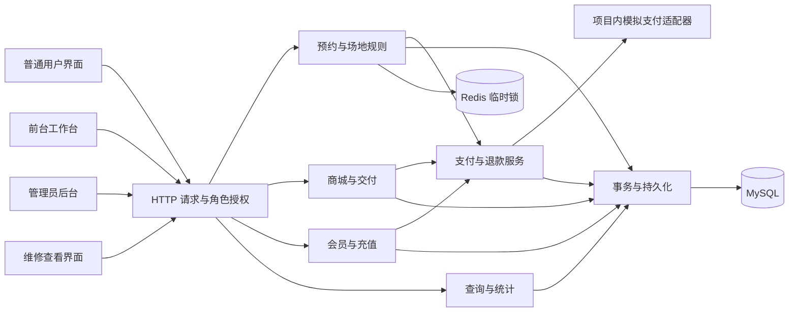
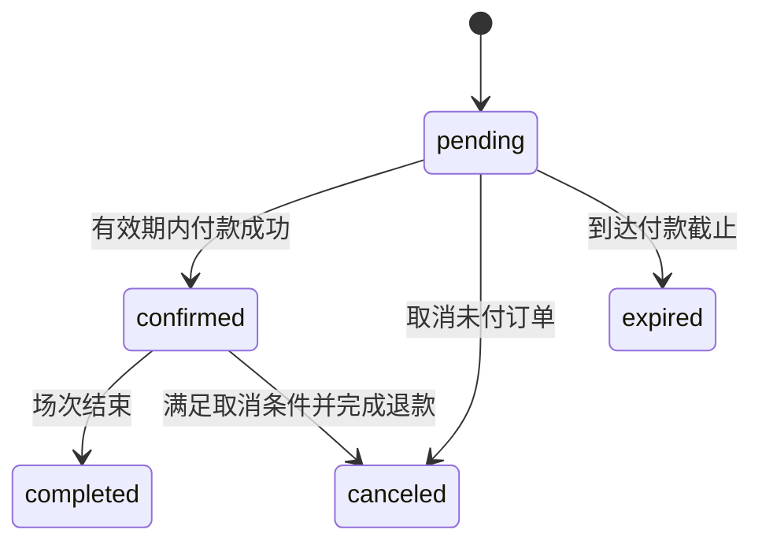
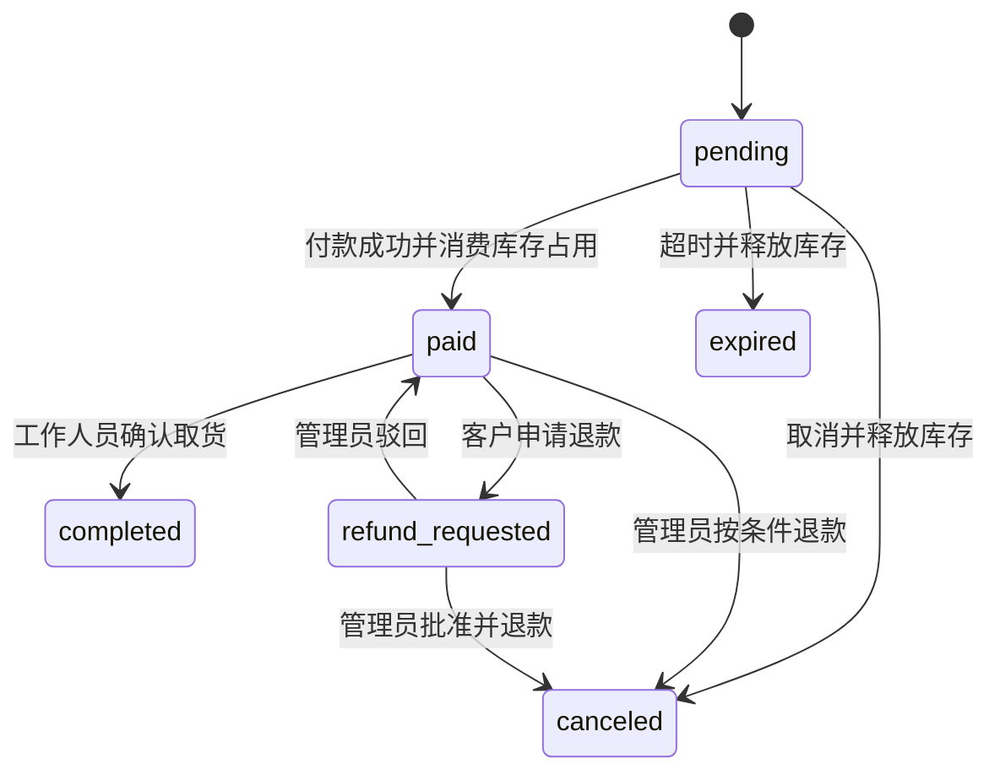

# 系统设计说明书

版本：SDD v1.0；日期：2026-09-23；状态：现有架构说明与新增功能设计，按批实施，当前进展见开发记录。[文档索引](README.md)。

实际落地状态见 [开发记录](开发进度与验证记录.md)，订场/商城状态机、代充值、全部订场查询及全局流水已接入并通过本地隔离验证；全量交付验收仍在进行。

## 1. 架构与模块职责

继续采用单体后端与前后端分离，不新增独立支付服务。项目内模拟支付可以与业务写入处于同一个 MySQL 事务；将来若接入外部支付，必须重新设计异步回调和资金对账，不能只换网关地址。

| 模块 | 现有代码入口 | 本批职责 |
| --- | --- | --- |
| 授权 | [BaseHandler](../../backend/handlers/base.py)、[路由](../../frontend/src/router/index.ts)、[认证状态](../../frontend/src/stores/auth.ts) | 集中角色判断、工作区导航、资源归属检查 |
| 场地与预约 | [预约服务](../../backend/services/reservation_service.py)、[运营服务](../../backend/services/booking_operations_service.py) | 按来源决定选时/会员规则，统一占用、整段开场和续场 |
| 支付退款 | [统一支付服务](../../backend/services/payment_service.py)、[收退款事务共用](../../backend/repositories/payment_common.py) | 增加统一支付单和退款记录；余额与模拟渠道按同一状态入口执行 |
| 商城 | [商城服务](../../backend/services/shop_service.py)、[商城收退款与取货事务](../../backend/repositories/shop_checkout_repository.py) | 核价、待付库存占用、支付、退款、商品交付 |
| 会员 | [会员服务](../../backend/services/member_service.py)、[会员事务](../../backend/repositories/member_repository.py) | 代充值、可用余额与积分差额、账户流水 |
| 报表 | [运营统计](../../backend/services/operations_statistics_service.py) | 统一查询投影，分开渠道收款与储值消费 |
| 维护 | [运营事务](../../backend/repositories/booking_operations_repository.py) | 维修分类、只读列表、保留管理员登记与释放 |

请求层负责解析与认证，service 负责业务决策，repository 负责事务与锁。金额、时间段、角色和状态规则集中复用，避免前台复制一套预约算法。

## 2. 领域关系与设计约定

- 客户是业务受益人；经办人是登录操作人。散客订单客户账户可以为空，经办人必须可追溯，不建立“前台共享客户账户”。
- 订场记录描述场地占用；订场订单保存应付快照；支付单描述一次应收款。续场建立新的关联订场记录，便于逐段查询、收款与退款。
- 商城订单保存商品快照，支付单处理收款，取货凭证记录整单交付。读取二维码不会改变订单状态。
- 账户流水只记录余额或积分变化；模拟消费若产生预约积分，可以记录余额变化为零的积分流水，不伪造余额收支。
- 全局流水是支付、退款、账户流水的统一检索投影，保留来源与关联，不复制成第二套可修改账本。

具体表名和字段见 [数据库设计](数据库设计说明书.md)。当前初始化与增量脚本已有 25 张表；业务接口的实现与验证范围按开发记录判断，不能只凭建表认定交付。

## 3. 场地时间与算法

### 3.1 整段计费

根据营业起点 `B`、时间段长度 `I` 与服务器当前分钟 `N`，当前段起点为 `B + floor((N-B)/I) × I`。仅在营业范围内、当前段未结束且完整段无冲突时允许散客开场。

计价复用现有整数分规则：`原价 = 每小时价格 × 完整计费分钟数 // 60`。散客折扣率固定为 100，积分为 0；线上预约沿用有效会员折扣与积分规则。例：单价 12000 分，60 分钟段，14:10 开 14:00–15:00，原价 12000 分；不是按 50 分钟计算。

第一版即时开场的首段须覆盖当前时刻，允许连续选择后续段；续场从关联链最后一段的结束时间衔接。每次选段仍遵守营业时间、配置粒度与单笔最长时长；不把前台为不同散客开场累计到前台个人每日预约次数中。

| 订单场景 | 设计付款截止时间 |
| --- | --- |
| 线上预约 | `min(创建时间 + 付款超时, 场次开始)`，保留原规则 |
| 散客当前段开场 | `min(创建时间 + 付款超时, 首个所选时间段结束)` |
| 散客续场 | `min(创建时间 + 付款超时, 续场开始)`，先付再使用新增段 |
| 商城与充值 | 创建时间 + 对应付款超时 |

多段开场以首段结束为界，避免 14:10 选择 14:00–16:00 后，拖到 15:10 才支付已结束的第一段；超时需按当时可用时段重新开单。这是实现确认规则的边界约定。到达截止时间即拒绝付款，后台清理间隔不构成宽限期。

### 3.2 统一冲突边界

两个同场地同日区间冲突，当且仅当 `new_start < old_end` 且 `new_end > old_start`。有效占用包括已确认预约、未过期的待付预约/散客/续场、有效维护及包场；过期单不能继续参与可用性计算。

线上预约、散客开场、续场、改期、维护创建共用场地行锁和事务内重查。新线上下单以用户与请求号唯一实现幂等，不再依赖 Redis 临时锁完成防重。Redis 继续承载既有缓存、会话等职责；无论临时锁是否存在，数据库里的有效待付单都占用该段。

### 3.3 推荐算法

保留 [现有前缀和实现](../../backend/utils/booking_operations.py)：对场地可用槽建立不可用前缀和，窗口差为零则为候选；按开始时间偏差、场地偏好、价格、碎片和稳定编号排序，最多返回三个。设场地数为 C、每场地槽数为 S、候选数为 K，扫描 O(CS)，排序 O(K log K)，不是全流程线性算法，也不保证全局最优。

新来源的有效占用必须进入同一槽表。推荐只读、不占位，最终提交重新检查。历史算法实验只验证原版本，不证明新增占用来源已接入。

## 4. 状态流转

### 4.1 订场与支付

`completed` 表示使用时段结束，不证明到场。原 `reservation_order` 保留状态兼容；新增支付单实际取值为 `pending → succeeded / canceled / expired`，全额退款后为 `refunded`。支付失败模拟只记录失败尝试，未过期支付单可重试；成功时间 `paid_at` 和原收款金额在退款后保留，退款另记退款记录，不抹掉原收款事实。

当前段散客付款成功时记录开场确认时间和经办人，可作为当前到店业务的到场依据；不能倒填为该段计费起点。提前支付的续场不能冒充已经发生的新到场事件。

### 4.2 商城与交付

`paid` 的用户文案为“已付款，待取货”。取货凭证在付款时生成，退款申请期间冻结使用；驳回恢复，退款成功失效，已核销不可重复领取。沿用当前 `completed` 不允许普通退款的限制，不新增已交付退货流程。

### 4.3 充值

充值单 `pending → paid / canceled / expired`。只有 `pending → paid` 会增加会员余额，且和模拟收款记录、账户流水、经办日志同事务提交。管理员人工调账不经过此流程，单独分类。

## 5. 收款、退款与改期

### 5.1 支付事务

1. 从支付单加载业务类型、固定金额和渠道，检查请求用户的角色与资源范围，不能用客户端金额覆盖应收额。
2. 按统一顺序加锁，重新检查状态、过期时间、客户状态及关联业务条件。
3. 余额渠道扣客户余额并写流水；模拟渠道写模拟收款结果，不扣余额。预约积分按原规则处理。
4. 同事务确认业务订单、库存或充值入账、支付状态、审计记录；商城生成取货凭证。
5. 提交后返回持久化结果。网络超时使用原请求号查单/重试；页面刷新失败不能反转已成功支付的提示。

### 5.2 按原渠道退款

退款前锁定订单，检查退款资格与已退款金额，退款与核销互斥。余额支付退回客户余额；模拟支付产生模拟退款记录，不增加余额。库存、积分回退和审计随同事务处理。退款总额不得超过关联成功收款扣除历史退款后的剩余额度。

线上预约本人取消仍沿用既有合法条件；前台无权处理已付退款；商城保留用户申请、管理员批准/驳回流程。散客退款由管理员处理且不得将正常“提前离场”自动转为退款。

### 5.3 保留改期能力

余额支付的原子改期保留。模拟渠道增加确认补差的交互，但不把待补差阶段视为改期成功：准备支付单时保存目标、原预约版本和报价，保留原场次；该准备动作不锁定目标场次。

- 正差额：用户完成内部模拟付款确认时，重新锁定原/目标场地并校验报价、版本、目标空闲；模拟收款与改期同事务提交。目标已占则不收款、原预约不变。
- 零差额：直接原子改期，无虚构零金额收款流水。
- 负差额：改期与原渠道退差同事务完成；模拟渠道不增加余额，会员积分按新旧权益差额更新。
- 多次改期：支付单保持原收款金额不变；退差按成功收款的时间、编号顺序分配到尚可退的原付款/补差付款，形成关联退款记录，防止后续取消超退。
- 报价过期或版本冲突：撤下旧报价，重新确认；不允许同一请求号更换目标或金额后重用。

这是适用于项目内模拟的简化事务方案，不要求外部扫码付款后再等待异步回调。

## 6. 商城库存与余额占用

商城引入待付后，使用独立库存占用记录：可销售量 = 商品实际未售库存 − 有效待付占用。创建订单锁商品行并占用数量；支付时库存扣减、销量增加、占用转已消费；未付取消/过期只释放占用；已付退款恢复库存与销量一次。核销不再扣库存。

余额待付单纳入可用余额计算，模拟渠道待付单不占余额。统一支付单上线后，余额占用以有效待付余额支付单为主；历史未挂新支付单的待付预约采用兼容分支，不能在新旧两套来源中重复求和。商品退款不是“释放未付占用”，两条路径分开。

后台降低商品库存时不得低于有效占用总量；已有有效订单保留价格快照。下架阻止新订单，已建有效订单仍可按快照支付和取货；需停止其交付时由管理员显式取消并释放/退款，不静默失效。

## 7. 并发、审计与故障处理

建议统一锁顺序：相关客户用户行（按 ID）→ 场地（按 ID）→ 业务订单（固定类型及 ID 顺序）→ 商品（按 ID）→ 会员账户 → 支付/退款/库存占用/核销子记录。所有改写同一资源的路径，包括清理任务和旧入口，必须一起适配；不能只约定新入口而保留相反锁顺序。

核心不变量：同场地同段至多一个有效安排；余额和库存不被并发写成负值；一笔支付最多成功一次；一次充值只增加一次余额；同一商品订单最多一个有效交付事实；业务、支付、流水与审计成功或失败一致。

幂等请求保存操作类型、主体、请求号和参数摘要。同号同参数返回原结果，同号异参数返回冲突；更换请求号也不能突破业务单唯一成功支付/核销约束。死锁回滚后按原请求号有限重试或提示刷新，禁止先报成功再补账。

定时任务与请求入口都识别过期。支付与过期竞争由同一行锁和状态条件决定，仅一方生效。Redis 释放失败依靠 TTL 恢复，但 MySQL 中过期业务不能继续阻塞可用性；通知故障不允许业务发生二次扣款。

## 8. 页面与信息设计

| 工作区 | 首屏任务 | 关键反馈 |
| --- | --- | --- |
| 用户 | 找场、待付订单、已付取货码 | 渠道、会员价、截止时间、最新价格变化、完整订单结果 |
| 前台 | 当日场地时间表，选中场地的接待和收款清单 | “14:00–15:00 整段 120 元，15:00 结束”；模拟收款标识；经办状态 |
| 管理员 | 待处理退款、全部订场与流水入口 | 来源与渠道筛选、关联订单详情、不同金额口径 |
| 维修 | 日期、场地、维修原因与安排 | 待开始/进行中/已释放；无任务时明确提示 |

沿用 BF 场馆导视、深绿和场地编号，不把每项信息都包成卡片。桌面前台使用时间表加收款侧栏；小屏使用单场地时间列表与确认抽屉。每个确认页面只保留一个主要提交动作。

取货二维码提供可读码备用输入；摄像头扫码可后续增强，不将摄像头权限作为第一版必需条件。取货查询页显示商品、数量和状态，经工作人员确认才执行。错误、加载、空数据、禁用、超时与键盘焦点均纳入验收。

## 9. 经营指标口径

| 指标 | 时间与计算来源 | 排除项 |
| --- | --- | --- |
| 渠道收款/退款/净收款 | 支付或退款发生时间；仅成功模拟渠道金额，净额 = 收款 − 退款 | 余额消费、积分、人工调账 |
| 储值充值 | 充值成功时间；模拟渠道收款的其中一项 | 不与渠道总收款相加 |
| 余额消费/退款 | 账户流水发生时间；按消费/退回类型归类 | 充值、人工调整、纯积分 |
| 消费结算净额 | 订场/商城成功收款 − 消费退款，包含余额和模拟两渠道 | 充值、人工调整；不等于正式会计收入确认 |
| 计费占用分钟 | 场次日期、有效订场区间，包含线上/散客/续场 | 取消、过期；不冒充真实在场时长 |
| 到场记录 | 事实记录与覆盖率，续场链不重复统计新到店人数 | 未记录历史、提前支付的未来续场 |

例：模拟充值 100 元后余额消费 100 元，渠道收款 100、其中储值充值 100、余额消费 100、消费结算 100；不能显示“渠道收款 200”。余额退款 100 则恢复储值余额，不产生模拟渠道退款。历史缺失支付凭据的记录标记“未核对”，不能计作已证实的收退款。
